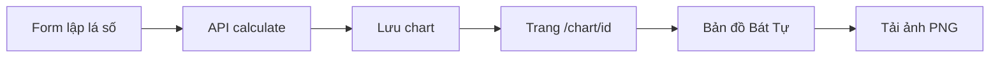

# Workflow — Hiển thị lá số (UX)

## Mục đích

Chuẩn hoá cách người dùng đọc lá số trên web sau khi lập xong.

## Luồng

## Quy ước hiển thị (đã chốt 2026-10-03 · cập nhật 0.2.0)

| Hạng mục | Quy ước |
|----------|---------|
| Phó tinh | Tên đầy đủ tiếng Việt, không viết tắt |
| Chân trang | Không liệt kê bảng viết tắt thập thần |
| Đại vận (lưới) | Một hàng, cột đều thu hẹp, không scroll ngang; thần sát wrap |
| Đại vận (chi tiết) | Click kỳ → panel web 2 cột VI (quan hệ / cấu trúc / thần sát); **không** xuất PNG |
| Đại vận (xuất PNG) | 5 dòng gọn trên cột kỳ |
| Lưu niên (chi tiết năm chọn) | Header + lưới 2 cột: Nạp âm / Trường sinh · Tàng can / Thần sát; cùng `text-xs` |
| Thần sát | Catalog 2.0; màu cat (xanh) / hung (đỏ) / phụ; danh sách dấu phẩy; Đào Hoa chỉ display |
| Khung đã bỏ | Khí trạng, Dụng thần, Nhật trụ đặc thù, Dữ liệu cấu trúc (không hiện UI) |
| Tiêu đề khung | Mỗi khung một màu ấm riêng để phân biệt |
| Ô góc bảng trụ | Nhãn **Thông tin** |
| Tuần / Không | Cột nhãn đủ rộng; nội dung một dòng, căn giữa |
| Ngũ hành (màu ký tự trụ) | Tạm giữ palette cũ đến khi user đổi |
| Nhãn quan hệ | Can/chi Việt có khoảng cách (`Tý Mùi hại`, không `TýMùi`) |

## Liên quan

- Spec tổng: [01.tong_the.md](./01.tong_the.md)
- HDSD: [docs/hdsd/01-lap-va-xem-la-so.md](../docs/hdsd/01-lap-va-xem-la-so.md)
- Shen Sha catalog note: [docs/phien-lam-viec/2026-10-03-shensha-catalog-v2-changelog.md](../docs/phien-lam-viec/2026-10-03-shensha-catalog-v2-changelog.md)
