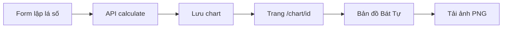

# Workflow — Hiển thị lá số (UX)

## Mục đích

Chuẩn hoá cách người dùng đọc lá số trên web sau khi lập xong.

## Luồng

## Quy ước hiển thị (đã chốt 2026-10-03)

| Hạng mục | Quy ước |
|----------|---------|
| Phó tinh | Tên đầy đủ tiếng Việt, không viết tắt |
| Chân trang | Không liệt kê bảng viết tắt thập thần |
| Đại vận | Lưới cột đều, tối đa 2 hàng, không scroll ngang; thần sát wrap |
| Tiêu đề khung | Mỗi khung một màu ấm riêng để phân biệt |
| Ô góc bảng trụ | Nhãn **Thông tin** |
| Tuần / Không | Cột nhãn đủ rộng; nội dung một dòng, căn giữa |
| Ngũ hành (màu ký tự trụ) | Tạm giữ palette cũ đến khi user đổi |

## Liên quan

- Spec tổng: [01.tong_the.md](./01.tong_the.md)
- HDSD: [docs/hdsd/01-lap-va-xem-la-so.md](../docs/hdsd/01-lap-va-xem-la-so.md)
