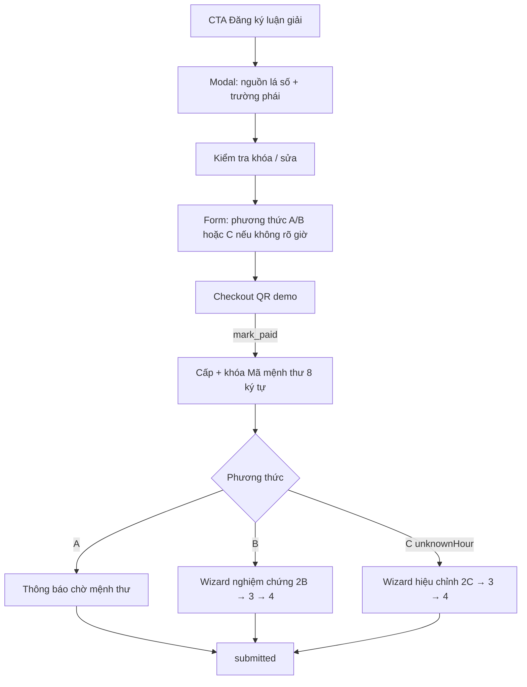

# Workflow — Đăng ký luận giải / mệnh thư

## Mục đích

Chuẩn hoá luồng user từ lá số → đăng ký → thanh toán → cấp mã → thu thập dữ liệu theo phương thức.

## Luồng

## Quy ước đã chốt (2026-10-04 · app 0.3.0)

| Hạng mục | Quy ước |
|----------|---------|
| Mã mệnh thư | Đúng 8 ký tự; alphabet an toàn (không `0/O/1/I`); có chữ + số; không lặp trong mã; hiển thị liền |
| Cấp mã | Chỉ khi thanh toán (`mark_paid` → `collecting`); trước đó `code = null` |
| Tra cứu mã | Chỉ upper-case; không chấp nhận `-` / khoảng trắng / ký tự dễ nhầm |
| Trường phái | Truyền thống / Manh phái — blurb «phù hợp nếu…» |
| Phương thức | Có giờ: chỉ A/B. Tick **Không rõ giờ sinh**: chỉ C «Hiệu chỉnh, tìm giờ sinh» |
| Không rõ giờ | Tick trên form lập lá số, form sửa reading, và intake; placeholder tính 12:00 |
| Thanh toán | QR demo + nút «Tôi đã chuyển khoản (demo)» giả webhook; PayOS thật sau |
| B nghiệm chứng | Chọn nhiều/tất cả lĩnh vực; mốc Ngày\|Tháng\|Năm (ngày tuỳ chọn); phần 3 tương lai + phần 4 câu hỏi |
| C hiệu chỉnh | Khoảng giờ + nguồn nhớ; ≥8 mốc định vị; rồi phần 3–4 như B |
| Store | Local `.data/reading-orders` (dev); production: DB + UNIQUE `code` + webhook |

## API

- `POST /api/reading/orders` — tạo đơn
- `PATCH /api/reading/orders/:id` — `save_basic` · `confirm_review` · `save_intake` · `mark_paid` · `save_post_pay`

## Việc tiếp (chưa làm)

- [ ] PayOS/Stripe thật + webhook ký
- [x] Không gian cá nhân sidebar (demo) — xem [04.khong_gian_ca_nhan.md](./04.khong_gian_ca_nhan.md)
- [ ] Auth + chỉ chủ đơn đọc; admin CSKH tra mã / cập nhật tiến độ

## Liên quan

- Types/repo: `src/lib/reading/*`
- UI: `src/components/reading/*`, `src/app/[locale]/reading/`
- HDSD: [docs/hdsd/02-dang-ky-luan-giai.md](../docs/hdsd/02-dang-ky-luan-giai.md)
