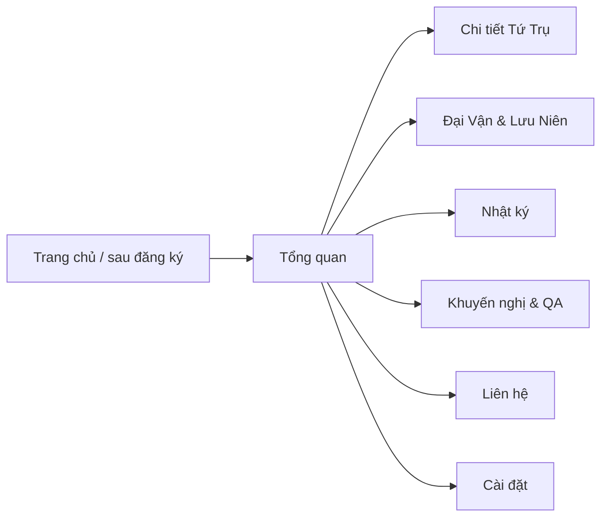

# Workflow — Không gian cá nhân (account sidebar)

## Mục đích

Khu vực sau đăng nhập (demo 1 user): theo dõi tiến độ luận giải, xem tứ trụ / đại vận, nhật ký nghiệm chứng, khuyến nghị, cài đặt.

## Luồng

## Sidebar (chốt theo mockup `public/slidebar`)

| Mục | Route |
|-----|--------|
| Tổng quan Mệnh cục | `/account/overview` |
| Chi tiết Tứ Trụ | `/account/pillars` |
| Đại Vận & Lưu Niên | `/account/dayun` |
| Nhật ký Nghiệm chứng | `/account/journal` |
| Khuyến nghị & Giải đáp | `/account/advice` |
| Liên hệ Chuyên gia | `/account/contact` |
| Cài đặt tài khoản | `/account/settings` |

Header sidebar: avatar, tên, **Mã mệnh thư**, trạng thái, CTA tải PDF (demo).

## Dữ liệu (0.4.0)

- Demo profile: `src/lib/account/demo-data.ts`
- Ghép đơn reading gần nhất + trụ từ chart nếu có: `get-account-context.ts`
- Auth Supabase / RLS — **chưa** (việc tiếp)

## Nền shell

- Ảnh: `public/brand/bg-shell-morning-paper.jpg`
- CSS: `.bazi-page-bg` (overlay kem nhẹ)

## Liên quan

- Mockup nguồn: `public/slidebar/*.txt`
- HDSD: [docs/hdsd/03-khong-gian-ca-nhan.md](../docs/hdsd/03-khong-gian-ca-nhan.md)
- Đăng ký luận giải: [03.dang_ky_luan_giai.md](./03.dang_ky_luan_giai.md)
